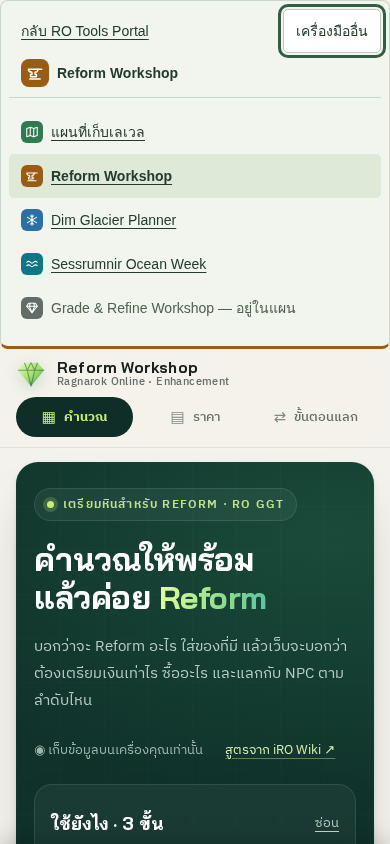
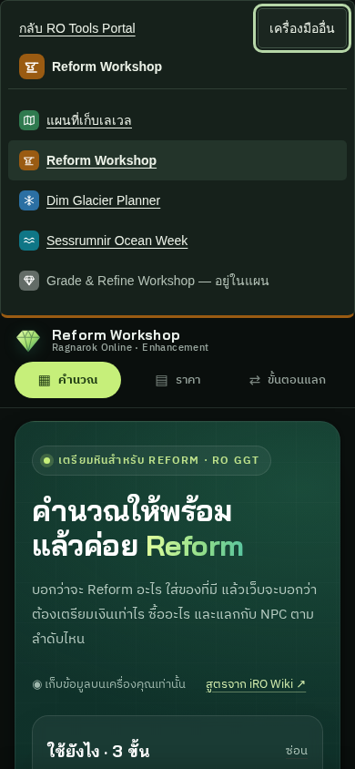
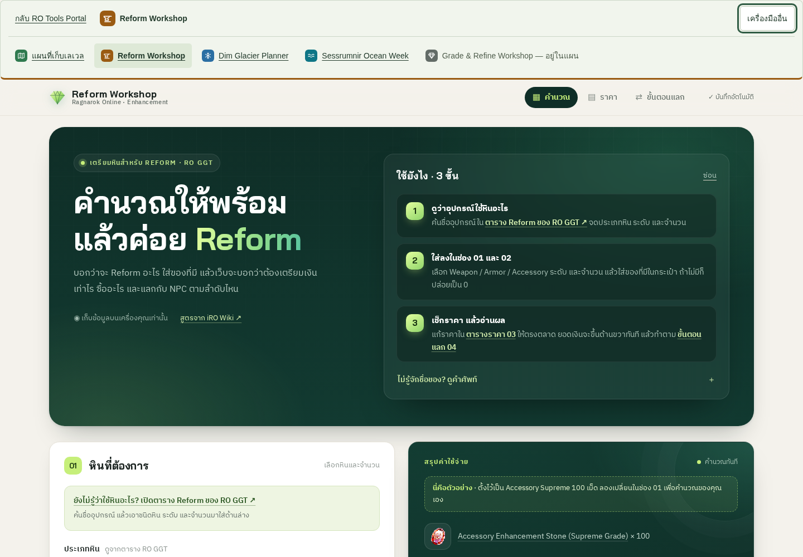
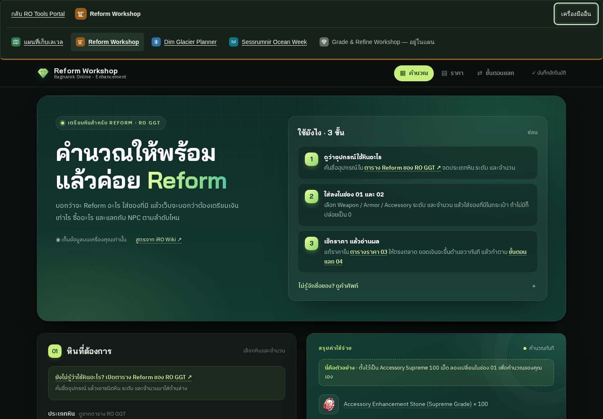

# ro-suite-nav 1.2.0 integration QA

## Scope and baseline

Base: `main` at `4bc1653fec1901a4121b86342f1ad0cc4ef55313`.
Publishing root stays the repository root (`.`); public path is
`https://econds.github.io/ro-reform-preparation/`.
No Pages settings or portal repository files were changed.

The tagged [integration README](https://github.com/econDS/ro_tools_portal/blob/nav-v1.2.0/integrations/nav/README.md)
was read before integration. All three release files were downloaded directly from
that tag; no bundle was generated or edited locally.

Before editing application source, `npm test` passed **74/74**, and
`node scripts/capture-ro-suite-baseline.cjs > tests/fixtures/ro-suite-nav-baseline.json`
recorded three complete inputs/results, 22 storage keys, original source hashes,
URL behavior and publication path. The fixture is a pre-change record, not a
snapshot regenerated from changed calculation code.

| Case | Total | Materials | NPC fees |
| --- | ---: | ---: | ---: |
| Accessory Supreme 100, defaults | 114,473,000 | 94,473,000 | 20,000,000 |
| Weapon Medium 12, partial stock | 777,500 | 617,500 | 160,000 |
| Armor High 5, Shadowdecon mode plus Reform | 1,783,740 | 693,740 | 1,090,000 |

The complete inputs, including prices, inventory and direct Reform material
demand, are in [`tests/fixtures/ro-suite-nav-baseline.json`](../../../tests/fixtures/ro-suite-nav-baseline.json).
The third case includes 4,990 z of direct Reform material cost in the total.

- Storage: `reform-workshop.v1`, 20 existing migration flags, and
  `reform-workshop.v1.quickstart-hidden`; the fixture lists every exact key
- Share: no share-state/query serialization feature exists in this version;
  existing document anchors are `#main`, `#calculator`, `#materials`, `#recipe`,
  and `#results`
- Export/import: no file export/import UI or data format exists in this version;
  existing JSON localStorage persistence is unchanged
- Theme: the existing CSS follows `prefers-color-scheme` and has no theme toggle;
  the nav deliberately omits `theme` so both follow system theme changes

## Runtime change

Only six lines are added to `index.html`: the fallback-containing nav and the
relative, versioned module script immediately after the skip link. The original
sticky header remains after the nav. `app.js`, `calculator.js`, and `styles.css`
remain byte-for-byte identical. No CSS override, global selector, sticky-header
adjustment, new storage key, iframe or remote catalog is introduced.

## Verified release hashes

| File | SHA-256 |
| --- | --- |
| `nav.js` | `d75be916445feb4febeaada437841a1b3be68db16a00673198c78fd6f6c8dc5f` |
| `catalog.snapshot.json` | `800bb9c9d2b52a7fbae58e436b05529e69820fee3627d199da545a6f5e28f7dd` |
| `nav.lock.json` | `3b0350135ba5f455b38799c7940492938a209e8e0a6570a5126cb40c36127358` |

The first two match both the approved values and the downloaded lock.
The lock's `sourceCommit` is release metadata, not a substitute for verifying
artifact hashes or a claim that this integration rebuilt the bundle.

## Checks run locally

- `npm test` before integration: 74 passed, 0 failed
- `npm test` after integration: 77 passed, 0 failed
- `sha256sum assets/ro-suite/1.2.0/*`: values above
- `git -c core.whitespace=cr-at-eol diff --check`: passed; existing HTML uses CRLF
- Browser launch with the installed Playwright/Chromium: blocked by this
  execution environment (`socket() failed: Operation not permitted`), including
  a sandbox-escalated attempt. This is not a browser test pass

Browser checks and screenshots are run by the narrowly scoped, read-only PR
workflow and documented in the PR with the exact successful run and artifacts.

## Browser results and screenshots

[Successful run 36757603021](https://github.com/econDS/ro-reform-preparation/actions/runs/36757603021)
tested commit `0d204d8cab39c4a491aa296bc3cdb01ee7b5fe6f` with
Playwright **1.55.1** / Chromium **140.0.7339.186**. The evidence-only follow-up
commit does not modify the app, nav assets, or test code.

Commands actually run in CI:

```sh
npm test
npm install --prefix "$RUNNER_TEMP/ro-suite-nav-qa" --no-save --package-lock=false --ignore-scripts playwright@1.55.1
node "$RUNNER_TEMP/ro-suite-nav-qa/node_modules/playwright/cli.js" install --with-deps chromium
npm start
NODE_PATH="$RUNNER_TEMP/ro-suite-nav-qa/node_modules" node tests/ro-suite-nav.browser.cjs
```

Results: **77/77 unit tests and 65/65 browser checks passed**. The full machine
report is preserved in [`report.json`](report.json); the
[original artifact](https://github.com/econDS/ro-reform-preparation/actions/runs/36757603021/artifacts/11117663241)
also contains the logs and all 12 screenshots (including closed and blocked-module states).

- Widths 360, 390, 768 and 1440, each in light and dark mode: no document/nav
  horizontal overflow, no control overlap, no nav/header/hero overlap at page top
- All upgraded nav links/buttons measured at least 44 × 44 CSS pixels
- Navigation text meets 4.5:1 contrast; theme changes on the same page update
  both nav and app without changing calculation, URL or storage
- Tab reaches skip link, portal link, toggle and tool links in order;
  Enter/Space open the menu, Escape closes it and restores opener focus;
  Tab-away and repeated activation work; Reform Workshop has `aria-current="page"`
- All three baseline cases match in the original page, integrated page and
  blocked-module page, including saved state/reload and complete model outputs
- The existing query and five hashes remain unchanged through calculator/nav use;
  all 22 app keys match; no new storage keys are written
- Blocking the exact local `nav.js` request preserves the visible, keyboard-usable
  fallback link and working calculator. Portal activation was verified by
  intercepting that destination with a test response, not by changing app markup
- **Zero** baseline or normal-page console/page/network/HTTP errors;
  the blocked-module scenario contains only its deliberate loading failure
- The real portal returned HTTP 200 in a separate `curl -IL --max-time 30`
  check on 2026-09-30

### Mobile, 390 × 844

Light:



Dark:



### Desktop, 1440 × 1000

Light:



Dark:



## Not tested / limits

- Physical phones/tablets, Firefox, Safari/WebKit and screen-reader output
- Post-merge GitHub Pages behavior: this PR has not been merged or deployed
- End-to-end navigation across every external tool; the fallback's portal
  destination is intercepted in automated tests, with a separate live HTTP check
- Import/export and state-sharing roundtrips are not applicable: the baseline
  app has neither feature. Existing persistence and query/hash behavior were tested

The workflow is limited to same-repository `feat/ro-suite-nav` pull requests into
`main`, has `contents: read`, does not persist checkout credentials, and has no
push, deployment, `workflow_dispatch` or Pages-configuration step.
